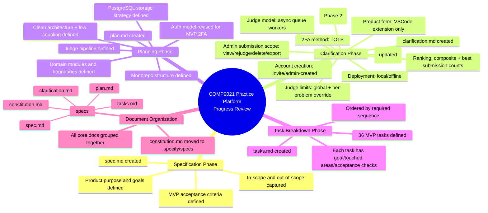

# Project Review Mindmap

```mermaid
mindmap
  root((COMP9021 Practice Platform
  Progress Review))
    Specification Phase
      spec.md created
      Product purpose and goals defined
      MVP acceptance criteria defined
      In-scope and out-of-scope captured
    Clarification Phase
      clarification.md created
      Product form: VSCode extension only
      Account creation: invite/admin-created
      2FA: mandatory in MVP (updated)
      2FA method: TOTP
      Judge limits: global + per-problem override
      Judge model: async queue workers
      Ranking: composite + best submission counts
      Plagiarism: excluded from MVP (Phase 2)
      Deployment: local/offline
      Admin submission scope: view/rejudge/delete/export
    Planning Phase
      plan.md created
      Clean architecture + low coupling defined
      Domain modules and boundaries defined
      Judge pipeline defined
      Auth model revised for MVP 2FA
      Monorepo structure defined
      PostgreSQL storage strategy defined
    Task Breakdown Phase
      tasks.md created
      36 MVP tasks defined
      Ordered by required sequence
      Each task has goal/touched areas/acceptance checks
    Document Organization
      constitution.md moved to .specify/specs
      All core docs grouped together
      specs
        constitution.md
        spec.md
        clarification.md
        plan.md
        tasks.md
```
